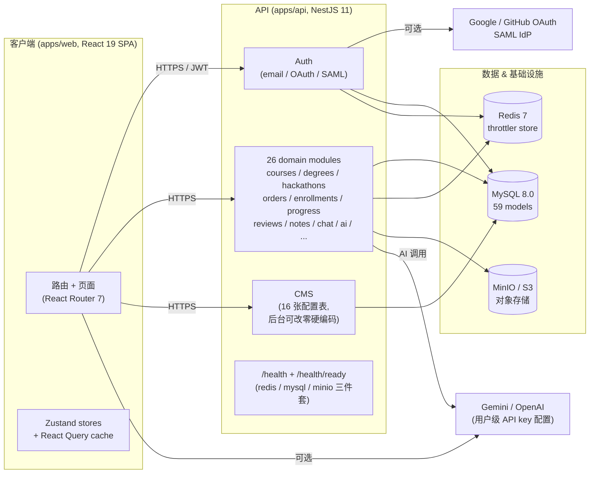
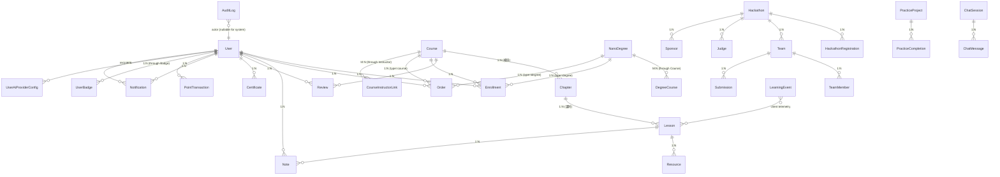
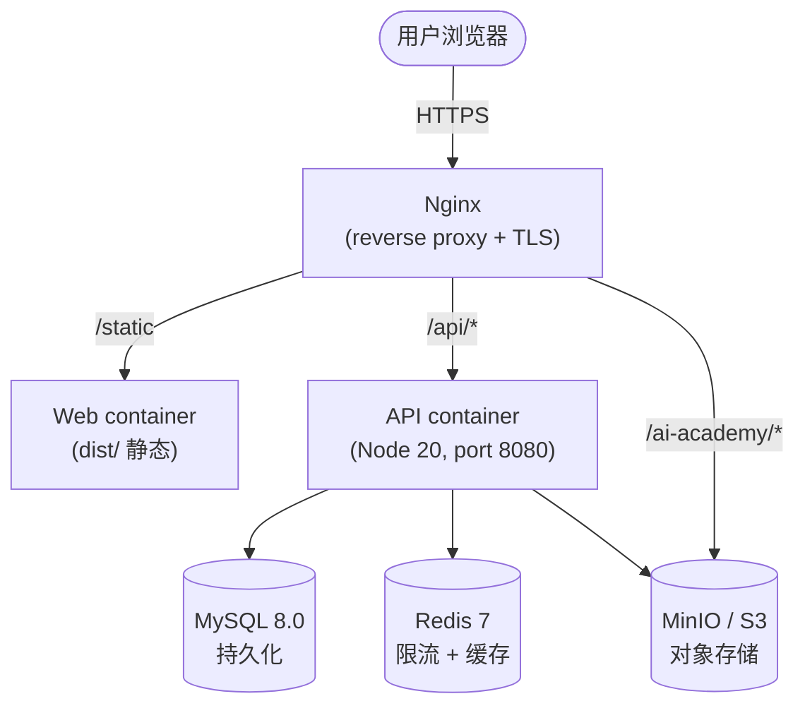

# AI Academy

> 一个可二次品牌化(white-label)的在线教育平台 —— 课程 / 学位 / 黑客松 / 实践项目 / 证书 / AI 助教,端到端可上线。
> pnpm monorepo,React 19 SPA + NestJS API + MySQL/Redis/MinIO。

| 指标 | 数字 |
| --- | --- |
| API 测试 | **38 suites / 347 tests** 全过 |
| Web 测试 | **22 files / 132 tests** 全过 |
| E2E (Playwright) | **29 passed / 1 skipped** (mobile-only) |
| API modules | **26 个域** (auth / courses / hackathons / ai / ...) |
| Prisma models | **59** / 索引 **105** |
| 真实业务流 e2e | **31/32 通过** (注册 → 课程 → 下单 → 支付 → 报名 → 通知) |

> **支付状态**:开发环境用 mock 流程;**生产环境 mock 接口 503**,购买/付款/退款需求走企业咨询工单(可追踪)。真实支付 + webhook 验证在后续 release 单独发布。

---

## 1. 架构总览



**关键设计原则**:
- **配置驱动**:后台可改的文案/枚举/导航/品牌色全部走 16 张 CMS 表,**源码零硬编码**(white-label 可改名/换色/换文案不改代码)
- **可插拔 auth**:`AUTH_PROVIDERS` 列表配置,email / OAuth Google / OAuth GitHub / SAML 任意组合
- **横向扩展**:Redis throttler store 让多实例部署时 rate limit 共享计数
- **白盒 + 闭源友好**:mock 支付 / 退款在生产 503,真实业务依赖 webhook(未启用前关闭)
- **可观测**:`/health/ready` 暴露 mysql/redis/minio 三件套状态

---

## 2. 代码地图

```text
ai-academy/                                 pnpm monorepo
├── apps/
│   ├── api/                                NestJS 11 REST API (port 8080)
│   │   ├── src/main.ts                     入口 + helmet CSP + 全局 ValidationPipe
│   │   ├── src/app.module.ts               根 module + ThrottlerModule(Redis store)
│   │   ├── src/modules/                    26 domain modules (见 §4)
│   │   ├── src/common/                     共享: guards / filters / pipes / redis / prisma
│   │   └── prisma/                         seed 脚本 (seed.ts / seed-cms / seed-instructors / bootstrap-production)
│   │
│   └── web/                                React 19 SPA (port 5500)
│       ├── src/router.tsx                  React Router 7 路由树 + lazy split
│       ├── src/features/                   14 个业务域: home / courses / degrees / hackathons / auth / admin / ...
│       ├── src/components/                 共享 UI: Layout / WebAssistant / 错误页 / 卡片
│       ├── src/stores/                     Zustand: auth / theme / webAssistant
│       ├── src/lib/                        api 客户端 / 各域 api wrapper / auth 适配器
│       └── e2e/                            Playwright 浏览器 smoke
│
├── packages/
│   └── shared-types/                       前后端共享 TS 类型 (zero deps)
│
├── prisma/
│   ├── schema.prisma                       59 models / 105 索引
│   └── migrations/                         22 已提交迁移
│
├── deploy/                                 生产部署工具集
│   ├── api-entrypoint.sh                   容器启动: migrate deploy → seed cms → bootstrap → start
│   ├── generate-production-env.mjs         生成 .env.production (random secrets)
│   ├── validate-production-env.mjs         校验生产 env 占位符
│   ├── nginx.conf                          反向代理 + SPA fallback + 静态资源
│   └── README.md                           完整发布 / 回滚 / 备份 SOP
│
├── docs/                                   用户 / 管理员 / 术语表 / 路线图
├── docker-compose.yml                      dev: mysql + redis + minio
├── docker-compose.production.yml           prod: 6 服务 (api + web + mysql + redis + minio + nginx)
├── .env.example                            dev 模板
├── .env.production.example                 prod 模板
├── pnpm-workspace.yaml
└── package.json                            根 scripts (dev / test / check / e2e / deploy:*)
```

---

## 3. 业务能力矩阵(按用户角色)

| 角色 | 能做什么 | 入口 |
| --- | --- | --- |
| **未登录访客** | 浏览课程 / 学位 / 黑客松 / 讲师,搜索,查看公开讲师统计,公开证书验证 | `/`, `/courses`, `/degrees`, `/hackathons`, `/instructors/:slug`, `/verify/:serial` |
| **学员(student)** | 上述 + 注册报名 / 下单(mockPay) / 自动获得报名 / 进度跟踪 / 笔记 / 评价 / helpful 投票 / 站内通知 / 课程 / 学位 / 黑客松 证书 | `/auth/login`, `/dashboard/*` |
| **讲师(instructor)** | 学员所有能力 + 公开讲师墙展示(自动从 `Course.instructor` 字符串回填,admin 可编辑) | `/instructors/:slug` |
| **管理员(admin)** | 所有学员能力 + 课程/讲师/用户/徽章/黑客松/企业咨询/审计/AI 配置/CMS 16 张表 CRUD + 草稿生成(AI) | `/admin/*` |

**关键业务规则**:
- 课程层级:`Course → Chapter(模块) → Lesson(课时) → Resource(资源)`,NanoDegree 统计课程数+课时数(不再把模块叫"章节")
- 报名获得:`order.mockPay()` / 课程完成钩子 / hackathon judge → 自动 issueCertificate
- 订单状态机:`pending → paid → (refunded)`,并发 pay 走 `updateMany + status guard` 原子化
- 笔记:lesson 级 + 可选 `positionSec`(视频时间点)
- AI 兜底:用户没配 API key 或上游报错 → 返回固定提示,不崩

---

## 4. API 模块地图(26 个 domain)

API 前缀 `/api/v1`,Swagger 在 `/api/docs`。

| 域 | 端点关键能力 | 鉴权 |
| --- | --- | --- |
| **auth** | 注册 / 登录 / refresh rotation / logout / `/:providerId/{start,callback}` OAuth / 密码重置 | 公开 + Bearer |
| **users** | CRUD + 软删(不用物理 delete) + 改密 / 改角色 / 改密(管理员) / 恢复账号 / 授权课程 / 授权学位 | 公开 + admin |
| **courses** | 列表(4 种 sort) / 详情 / 模块+课时+资源 CRUD / 评分 / helpful / 评价防重 | 公开 + admin |
| **degrees** | 学位 CRUD / 课程关联 / 学员进度 | 公开 + admin |
| **enrollments** | 报名 / 重复幂等 / 软删 | Bearer |
| **progress** | 课时完成 / 跨设备同步 / 课程 100% 触发证书 | Bearer |
| **notes** | lesson 笔记 CRUD(本人编辑) | Bearer |
| **reviews** | 评价 CRUD / helpful 投票去重 | Bearer |
| **orders** | 创建 / mockPay(开发) / 取消 / 退款(mock) | Bearer |
| **hackathons** | 赛程 CRUD / 报名 / 团队 / 作品提交 / 评审 / 公告 / 赞助商 | 公开 + Bearer + admin |
| **instructors** | 公开讲师墙(仅 published) / 统计 / 专长 | 公开 + admin |
| **badges** | 学员徽章 / admin CRUD | 公开 + admin |
| **points** | 积分流水 / 排行榜 | Bearer |
| **certificates** | 颁发 / 公开验证 `/verify/:serial` | 公开 + Bearer |
| **practices** | 实践项目 CRUD / 学员开始+完成 / 评测结果 | Bearer + admin |
| **chat** | WebAssistant 会话 / 消息 / RAG 检索(Prisma contains 兜底) | Bearer |
| **ai** | 草稿生成(课程/学位) / 用户级 provider 配置 | Bearer |
| **notifications** | 站内信 / 4 类 enum / 未读计数 | Bearer |
| **learning-events** | 客户端学习事件上报(用于分析) | Bearer |
| **enterprise** | 企业咨询 / 询价工单 / 邮件通知 | 公开 + admin |
| **uploads** | 预签名上传到 S3/MinIO | Bearer |
| **url-import** | URL 解析(用于课程内容导入) | Bearer |
| **audit** | 审计日志(谁在什么时间操作了什么) | admin |
| **admin** | 看板 KPI / 用户管理 / 课程管理 / 设置 | admin |
| **cms** | 16 张配置表(enum_translations / site_settings / page_settings / industries / testimonials / ...) | admin |
| **health** | `GET /health` (liveness) / `GET /health/ready` (mysql+redis+minio) | 公开 |

完整 Swagger:<http://localhost:8080/api/docs>

---

## 5. 数据模型速览



设计要点:105 索引、软删(`deletedAt`)统一策略、order/pay 走 `updateMany + status guard` 防并发、`AuditLog` 记录所有管理操作。

---

## 6. 快速开始(5 分钟)

### 前置

- Node.js 20+
- pnpm 11.12+ (`corepack enable`)
- Docker Desktop / Compose

### 一气呵成

```bash
git clone <repo>
cd ai-academy
pnpm install
cp .env.example .env            # 已含 dev 默认值, 改 JWT_SECRET 即可
docker compose up -d            # 启动 mysql :3307 + redis :6380 + minio :9010
pnpm --filter @ai-academy/api exec prisma generate
pnpm db:migrate                 # 应用迁移
pnpm db:seed                    # 写入 6 课程 / 2 学位 / 6 黑客松 / admin & student 账号
pnpm --filter @ai-academy/api exec ts-node ../../prisma/seed-instructors.ts  # 讲师回填(公开讲师墙)

pnpm dev                        # api :8080 + web :5500
```

启动后会拿到:

| 服务 | 地址 |
| --- | --- |
| **Web 前端** | <http://localhost:5500> |
| **API 后端** | <http://localhost:8080/api/v1> |
| **Swagger API 文档** | <http://localhost:8080/api/docs> |
| **健康检查(redis/mysql/minio 三件套)** | <http://localhost:8080/api/v1/health/ready> |

> **局域网访问**:把 `localhost` 换成机器 IP(同 WiFi 下手机/另一台电脑可看)。Mac 用 `ifconfig | grep "inet "` 查。

---

## 7. 演示指南(给"非技术"同事 / 投资人 / 客户)

> 不用装任何东西、不用懂代码。浏览器打开 4 个页面就行。

### 3 步进系统

1. **打开** <http://localhost:5500>(让服务跑的人给你地址)
2. **登录**(任选一个账号,都已写库 — 见下方账号清单)
3. **点对应的路径** — 5 分钟看完所有能力

### 账号清单(7 个,任选登)

| 角色 | 邮箱 | 密码 | 用途 |
| --- | --- | --- | --- |
| **管理员** | `admin@ai-academy.local` | `admin123` | 登 `/admin/*` 看后台所有功能 |
| **学员(原始)** | `student@test.com` | `123456` | 看前台,演示主用 |
| **学员(e2e 1)** | `biztest1785846398673@academy.test` | `BizTest!Pass2026` | 已下过 1 单(mockPay paid),演示订单管理 |
| **学员(e2e 2)** | `biztest1785846469464@academy.test` | `BizTest!Pass2026` | 演示用,无订单 |
| **学员(e2e 3)** | `biztest1785846579112@academy.test` | `BizTest!Pass2026` | 演示用,无订单 |
| **学员(e2e 4)** | `biztest1785846611781@academy.test` | `BizTest!Pass2026` | 演示用,无订单 |
| **学员(e2e 5)** | `viztest1785846634434@academy.test` | `BizTest!Pass2026` | 演示用,无订单 |

> 所有账号的 `passwordResetRequired` 已设成 `false`,登进去不会被强制改密。生产 seed 行为不同(强制改密 + 强密码)。

### 5 条必看路径

| # | 角色 | 路径 | 看什么 |
| --- | --- | --- | --- |
| 1 | **访客**(不用登) | <http://localhost:5500/> | 首页 8 段位、热门课程、CTA 按钮 |
| 2 | **访客** | <http://localhost:5500/courses> | 6 个 seed 课程,4 种排序(newest/recent/rating/popular) |
| 3 | **学员**(`student@test.com`) | <http://localhost:5500/dashboard/orders> | "我的订单" — 1 笔真实 mock 支付订单(¥79.99 · 白帽黑客:数字防御) |
| 4 | **学员**(`biztest1785846398673@academy.test`) | <http://localhost:5500/dashboard/orders> | 同上,已付 paid,可演示证书验证 |
| 5 | **管理员**(`admin@ai-academy.local`) | <http://localhost:5500/admin/dashboard> | 后台看板:KPI / 课程管理 5 tab / 用户管理 Drawer / 审计日志 / AI 配置 |

### 管理员后台完整路径(10 个子页面)

> 全部在 `/admin/*` 命名空间下,登管理员账号后直接点侧边栏访问。

| # | 路径 | 作用 | 看点 |
| --- | --- | --- | --- |
| 1 | <http://localhost:5500/admin/dashboard> | 看板首页 | KPI / 图表 / 待办 / 系统状态 |
| 2 | <http://localhost:5500/admin/courses> | 课程管理 | 5 tab 编辑(info / chapters / practices / pricing / publish) |
| 3 | <http://localhost:5500/admin/degrees> | 学位管理 | 学位 CRUD + 关联课程 |
| 4 | <http://localhost:5500/admin/users> | 用户管理 | 列表 + 行内 Drawer(6 section:基本/学习/订单/证书/积分/活动日志) |
| 5 | <http://localhost:5500/admin/badges> | 徽章管理 | 徽章 CRUD |
| 6 | <http://localhost:5500/admin/hackathons> | 黑客松管理 | 赛程/报名/团队/作品提交/评审 |
| 7 | <http://localhost:5500/admin/enterprise> | 企业询价 | 咨询工单列表 + 状态流转 |
| 8 | <http://localhost:5500/admin/reviews> | 评价审核 | 学员评价列表 + helpful 统计 |
| 9 | <http://localhost:5500/admin/audit> | 审计日志 | 谁在什么时间操作了什么(下完单会写 `order.create` / `order.pay`) |
| 10 | <http://localhost:5500/admin/settings> | AI 设置 | 用户级 API key 配置(Gemini / OpenAI / Claude / Ollama 任意配) |

### 演示一条完整业务流(2 分钟)

跟着点一遍,展示从访客到学员到管理员的全链路:

1. 打开 `/`,点首页"开始学习" → 跳到 `/courses`
2. 点任一课程 → 跳到 `/courses/:id` 详情页
3. 点"立即报名" → 跳到 `/auth/login` 注册 / 登录
4. 学员登录后 → 回课程详情,再点"立即报名"
5. 跳到 `/dashboard/orders` → 看到刚下的订单
6. 点"支付"按钮 → mockPay 立即把订单标 paid
7. 自动跳转 → 显示已获得课程报名、证书已颁发
8. **切换管理员** → `/admin/audit` 看到刚才那条 `order.create` + `order.pay` 审计记录
9. 切到 `/admin/users` → 在 Drawer 看刚才那学员的订单/证书/积分记录
10. 切到 `/admin/courses` → 编辑课程定价 / 模块 / 资源,改完保存

### 7 个更多可点的(可选)

| 路径 | 角色 | 卖点 |
| --- | --- | --- |
| `/hackathons` | 公开 | 6 个黑客松,有 `upcoming` 的能点"报名" |
| `/instructors/sky-walker` | 公开 | 讲师墙详情页(从 `Course.instructor` 字符串回填的 6 个讲师) |
| `/degrees` | 公开 | 2 个学位项目(自动统计关联课程数) |
| `/verify/:serial` | 公开 | 公开证书验证 — 学员下完单会自动签发证书,管理员可在 `/admin/courses` 找 |
| `/admin/courses` | admin | 课程编辑 5 tab(info / chapters / practices / pricing / publish) |
| `/admin/users` | admin | 用户管理 Drawer — 6 个 section(基本信息 / 学习概况 / 订单 / 证书 / 积分 / 活动日志) |
| `/admin/settings` | admin | AI provider 配置 — Gemini / OpenAI / Claude / Ollama 任意配,保存即可用 |

### 演示数据快照

```
users: 7 (1 admin + 1 student + 5 e2e biztest)
courses: 6          degrees: 2          hackathons: 6
instructors: 6      badges: 10
enrollments / orders / hackathonRegs — 看你演示时跑出来的
```

### 已知边界(演示时直接告诉对方,别装作没事)

| 功能 | 当前状态 | 原因 |
| --- | --- | --- |
| **真实支付** | mock 流程,生产环境 503 | 没接 Stripe / 微信 / 支付宝,真实支付 + webhook 验证在后续 release 单独发 |
| **AI 助手对话** | 没配 `GEMINI_API_KEY` 时回"AI 服务暂不可用" | `/admin/settings` 配用户级 API key 即可恢复(任何 provider) |
| **OAuth Google/GitHub / SAML** | 默认只启 `email_password` | 在 `.env` 配 `AUTH_PROVIDERS=...` + 对应 client id/secret 即可 |
| **真实邮件发送** | 询价通知默认只落库 | 设 `RESEND_API_KEY` + `MAIL_FROM` 即发邮件 |

### 启停命令速查

```bash
# 启动
pnpm dev                          # API + Web(热更新)
pnpm dev:api                      # 只 API
pnpm dev:web                      # 只 Web

# 看进程
lsof -iTCP:8080 -iTCP:5500 -sTCP:LISTEN

# 停
pkill -f "nest\|vite"

# 跑测试
pnpm check          # lint + test + build
pnpm e2e            # Playwright 浏览器 smoke
```

---

## 8. 常用命令

| 命令 | 作用 |
| --- | --- |
| `pnpm dev` | 同时起 API + Web (热更新) |
| `pnpm dev:api` / `pnpm dev:web` | 单独起一个 |
| `pnpm test` | API Jest + Web Vitest + deploy 校验 |
| `pnpm check` | lint + 全量测试 + 前后端生产构建(发版前必跑) |
| `pnpm lint` | 全 workspace lint/typecheck |
| `pnpm build` | API + Web 单独构建(产物到 `apps/*/dist/`) |
| `pnpm e2e` | Playwright 浏览器 smoke(自动起 dev server) |
| `pnpm db:migrate` | 开发环境迁移 |
| `pnpm db:migrate:prod` | 生产环境迁移(只 apply,不创建新迁移) |
| `pnpm db:seed` | dev 种子数据(6 课程 / 2 学位 / 6 黑客松) |
| `pnpm db:studio` | Prisma Studio |
| `pnpm deploy:generate-env` | 生成 `.env.production`(random secrets + image SHA) |
| `pnpm deploy:validate` | 校验生产 env 配置(无占位符 / 必填项) |

---

## 9. 环境变量(关键)

完整模板:[`.env.example`](./.env.example) / [`.env.production.example`](./.env.production.example)

| 变量 | 用途 | 必填 | 生产要求 |
| --- | --- | --- | --- |
| `DATABASE_URL` | MySQL 连接 | ✓ | 独立账号,非 root |
| `JWT_SECRET` | JWT 签名 | ✓ | ≥32 字符,`openssl rand -hex 32` |
| `REDIS_HOST` / `REDIS_PORT` / `REDIS_PASSWORD` | 缓存 + 限流 | ✓ | 独立密码实例 |
| `CORS_ORIGIN` | Web 来源白名单 | ✓ | 只填正式域名 |
| `AUTH_PROVIDERS` | 启用的登录方式列表 | ✓ | `email_password` / `oauth.google` / `oauth.github` 逗号分隔 |
| `AUTH_OAUTH_*` | Google / GitHub OAuth | 可选 | 生产回调用 HTTPS |
| `AUTH_SSO_SAML_*` | SAML IdP | 可选 | 配置证书后再启用 |
| `GEMINI_API_KEY` | AI 助手默认 key(服务端) | 可选 | 用户级 key 走 `UserAiProviderConfig`,此 key 作 fallback |
| `MINIO_*` / `S3_*` | 对象存储 | ✓ | 生产用 S3, dev 用 MinIO |
| `AI_KEY_ENCRYPTION_KEY` | 加密用户 AI key | ✓ | 64 位 hex(32 字节) |
| `BOOTSTRAP_DATA` | 首次启动写 admin + 示例学员 | 可选 | 首次 `true`,之后 `false` |
| `ENTERPRISE_NOTIFY_EMAIL` | 企业询价通知邮箱 | 可选 | 不填则只落库 |

### 可插拔 auth 示例

```bash
# 仅邮箱密码
AUTH_PROVIDERS=email_password

# 邮箱 + Google OAuth
AUTH_PROVIDERS=email_password,oauth.google
AUTH_OAUTH_GOOGLE_CLIENT_ID=xxx.apps.googleusercontent.com
AUTH_OAUTH_GOOGLE_CLIENT_SECRET=xxx
AUTH_OAUTH_GOOGLE_REDIRECT_URI=https://academy.example.com/auth/oauth/callback

# 全部
AUTH_PROVIDERS=email_password,oauth.google,oauth.github,sso.saml
```

---

## 10. 部署架构



**6 个服务**:`docker-compose.production.yml` 一键起,镜像来自 `ghcr.io/frankfika/aicourse-{api,web,runtime}:<git-sha>`,**不可变部署**(镜像 SHA 跟 git commit 绑定)。

**发布流程**:
1. `pnpm check` 必过
2. `pnpm deploy:generate-env --domain academy.example.com --admin-email x --student-email y --image-sha $(git rev-parse HEAD)` 生成 `.env.production`
3. `pnpm deploy:validate` 校验
4. `scp` 上传 + `docker compose -f docker-compose.production.yml up -d`
5. 容器 entrypoint 跑 `prisma migrate deploy` + `seed-cms` + `seed-instructors` + `bootstrap-production`(空库首次) + start

完整 SOP + 回滚 + 备份:见 [`deploy/README.md`](./deploy/README.md)

**支付上线前置条件**(未完成前不要开启):
1. 接入真实支付网关 SDK
2. 服务端校验 webhook 签名 / 金额 / 币种 / 订单号 / 幂等键
3. 支付成功**只能**由可信 webhook 改变订单状态
4. 完成 1-3 前,生产 mock 接口 503,UI 把购买/付款/退款转入企业咨询

---

## 11. 质量门(发版前必过)

```bash
pnpm check       # lint + test + build  (全 workspace 0 错)
pnpm e2e         # Playwright 浏览器 smoke  (真后端 + 真前端)
pnpm deploy:validate   # 生产 env 校验
```

| 维度 | 当前 | 触发条件 |
| --- | --- | --- |
| API Jest | 38 suites / 347 tests 全过 | `apps/api` 改 controller / service / dto |
| Web Vitest | 22 files / 132 tests 全过 | `apps/web` 改组件 / hook / lib |
| E2E Playwright | 29 passed / 1 skipped(mobile-only) | 任何路由 / 鉴权 / 公开页改动 |
| TS check | 0 错 | `pnpm -r lint` |
| Vite build | 0 错(主 bundle 不暴露 dev-only 路由) | `apps/web` 任何改动 |
| Nest build | 0 错 | `apps/api` 任何改动 |
| deploy validate | 0 占位符 | 改 `.env.production` 后必跑 |

---

## 12. 文档地图

| 文档 | 适用 | 内容 |
| --- | --- | --- |
| [用户手册](./docs/USER_MANUAL.md) | 学员 | 注册 / 选课 / 学习 / 笔记 / 证书 / 黑客松报名 |
| [管理员手册](./docs/ADMIN_MANUAL.md) | admin | 课程上架 / 审核 / 黑客松编排 / CMS / 审计 |
| [术语表](./docs/GLOSSARY.md) | 全员 | 模块 / 课时 / 学位 / NanoDegree / 实践项目 |
| [产品路线图](./docs/ROADMAP-1.6.md) | 产品/技术 | v1.5.x 工程基线 + v1.6.0 RAG / SSE / PWA 规划 |
| [生产部署运行手册](./deploy/README.md) | 运维 | 容器编排 / Nginx / TLS / 备份 / 回滚 |
| [完整 Changelog](./CHANGELOG.md) | 全员 | 每个 release 详细 notes(命名 `vMAJOR.MINOR.PATCH`) |
| [Prisma Schema](./prisma/schema.prisma) | 开发 | 59 model + 105 index 完整定义 |
| Swagger | 开发 | 启动 API 后看 `/api/docs`(在 `/api/docs-json` 拿 JSON) |

---

## 13. 贡献

```bash
git checkout -b feature/your-change
pnpm check                    # 必过
git add <specific files>      # 不要 git add . (避免误带 .env / untracked)
git commit -m "feat: ..."
git push origin feature/your-change
```

PR 必须说明:
- 行为变化(用户可见)
- 数据库迁移(`prisma migrate dev` 产物)
- 环境变量变化(更新 `.env.example` / `.env.production.example`)
- 验证结果(`pnpm check` + `pnpm e2e` 输出)

详细 release notes 模板见 [`CHANGELOG.md`](./CHANGELOG.md)。

---

## License

[`LICENSE`](./LICENSE)
