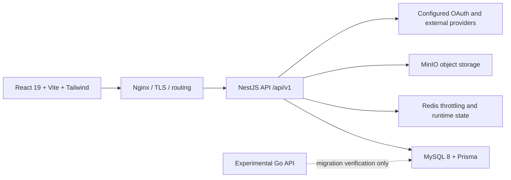

# AI Academy

**English** | [简体中文](./README.zh-CN.md)

AI Academy is a full-stack learning platform for AI courses, nano-degrees, hackathons, certificates, and enterprise training. The current production application uses a React/Vite frontend and a NestJS API. A Go API exists only as an experimental migration target and must not receive production traffic yet.

## Release status

| Check | Current result |
| --- | --- |
| NestJS API tests | **42 suites / 363 tests passed** |
| Web unit tests | **30 files / 157 tests passed** |
| Playwright browser tests | **43 passed / 3 conditional skips** |
| Real dependency flow | **9/9 passed** |
| TypeScript and production builds | **Passed** |
| Production API | **NestJS only** |

> **Payments:** mock payment and refund operations are development-only. Production mock endpoints return `503`; paid purchase and refund requests are routed to a traceable enterprise inquiry flow until a real payment provider and verified webhooks are released.

> **Legal content:** the public legal pages now describe only the currently available capabilities. They are product copy, not a substitute for jurisdiction-specific legal review.

## What is included

### Learners

- Browse published courses, nano-degrees, instructors, and hackathons.
- Filter free, paid, and charity courses without silently hiding a category.
- Enroll in free content and track lesson completion.
- Receive course certificates after completing all lessons.
- Receive degree certificates only after completing every lesson in every course attached to an active degree enrollment.
- Review orders, certificates, notifications, account bindings, and AI preferences from the learner dashboard.
- Verify active certificates through the public verification page.

### Instructors and administrators

- Manage courses, chapters, lessons, degrees, instructors, users, badges, hackathons, enterprise inquiries, reviews, AI settings, and site configuration.
- Use CMS-backed navigation, page copy, enums, industries, testimonials, search terms, and footer content.
- Inspect audit logs and operational dashboards based on real stored events.
- Configure email/password and supported OAuth providers. SAML is not advertised as enabled until its complete redirect and callback flow is available.

### Reliability and product safeguards

- Anonymous degree APIs expose published content only.
- API failures render explicit retry states instead of pretending that no content exists.
- Missing AI providers and unfinished Go AI/URL-import features return `503` instead of fabricated success data.
- Payment never acts as proof of course or degree completion.
- Revoked certificates remain auditable and do not block a later legitimate certificate.
- Notification links are constrained to real dashboard routes.
- Dialogs and drawers include accessible names, Escape handling, focus trapping, and focus restoration.
- Production request-body limits are applied at the reverse proxy before requests reach the API.

## Architecture



The public API prefix is `/api/v1`. Swagger is available at `/api/docs` in environments where API documentation is enabled.

Health endpoints:

- `GET /api/v1/health` — liveness.
- `GET /api/v1/health/ready` — MySQL, Redis, and MinIO readiness.

## Repository layout

```text
.
├── apps/
│   ├── api/                 NestJS production API
│   ├── api-go/              experimental Go migration target
│   └── web/                 React/Vite web application
├── packages/
│   └── shared-types/        shared TypeScript contracts
├── prisma/                  canonical schema and migrations
├── deploy/                  production validation and entrypoints
├── scripts/                 setup and real-flow E2E scripts
├── docs/                    architecture and roadmap documents
├── docker-compose.yml       local dependencies
└── docker-compose.production.yml
```

## Quick start

### Requirements

- Node.js 20 or newer
- pnpm 11.18.0
- Docker Desktop or a compatible Docker engine

### Automated demo setup

```bash
pnpm install
pnpm setup:demo
```

The setup script starts the local dependencies, prepares the database, loads demo data, and starts the application. Open <http://localhost:5500> for the web app and <http://localhost:8080/api/docs> for Swagger.

### Manual setup

```bash
cp .env.example .env
pnpm install
docker compose up -d mysql redis minio
pnpm db:generate
pnpm db:migrate
pnpm db:seed:demo
pnpm dev
```

Do not reuse `.env.example` credentials in production. Production configuration must pass the repository validation script before deployment.

## Common commands

```bash
pnpm dev                 # start all workspace development servers
pnpm dev:web             # start the web application only
pnpm dev:api             # start the NestJS API only
pnpm lint                # TypeScript and lint checks
pnpm test                # deployment, API, and web unit tests
pnpm build               # production builds
pnpm check               # lint + unit tests + production builds
pnpm e2e                 # Playwright browser suite
pnpm e2e:real            # real API + DB + Redis + MinIO business flow
pnpm check:go            # Go formatting, vet, build, and non-Docker tests
pnpm check:full          # complete local release gate
pnpm deploy:validate     # validate production environment configuration
```

The Go Docker E2E suite is intentionally excluded from `check:go`: it currently starts many MySQL containers and is not yet a stable release gate. Go production routing remains blocked until that suite and the missing provider/storage capabilities are complete.

## Configuration

Copy `.env.example` to `.env` for local development. Important groups include:

| Group | Purpose |
| --- | --- |
| `DATABASE_URL` | MySQL connection used by Prisma |
| `REDIS_URL` | shared throttling and runtime state |
| `MINIO_*` | object-storage endpoint and credentials |
| `JWT_*` | access and refresh token signing |
| `AUTH_PROVIDERS` | enabled authentication provider list |
| `AUTH_OAUTH_*` | OAuth client and callback configuration |
| `PAYMENT_*` | explicit development-only payment capability switches |
| `CORS_ORIGINS` | allowed production web origins |

Authentication examples:

```bash
# Email and password only
AUTH_PROVIDERS=email_password

# Email and Google OAuth
AUTH_PROVIDERS=email_password,oauth.google
AUTH_OAUTH_GOOGLE_CLIENT_ID=example.apps.googleusercontent.com
AUTH_OAUTH_GOOGLE_CLIENT_SECRET=replace-me
AUTH_OAUTH_GOOGLE_REDIRECT_URI=https://academy.example.com/auth/oauth/callback
```

Only advertise a provider after its complete start, callback, account-linking, and error paths have been verified.

## Production deployment

Production runs the NestJS API behind Nginx with MySQL, Redis, and MinIO. The deployment workflow is manually dispatched and creates an immutable release directory before switching the `current` symlink.

Before deployment:

```bash
pnpm check:full
pnpm deploy:validate
docker compose --env-file .env.production -f docker-compose.production.yml config --quiet
```

The production workflow expects configured GitHub environments and deployment secrets. Creating a GitHub release does not automatically deploy production.

## Release policy

- Versions follow `vMAJOR.MINOR.PATCH`.
- The root package, API, web app, shared types, and displayed footer version must stay aligned.
- Release notes and commit messages are written in English first.
- A release requires green TypeScript checks, unit tests, browser E2E, production builds, and the real dependency flow when the required local services are available.
- The Go API cannot be promoted by version number alone; its explicit migration gates still apply.

See [CHANGELOG.md](./CHANGELOG.md) for release history.

## Documentation

| Document | Audience |
| --- | --- |
| [Chinese README](./README.zh-CN.md) | Chinese-language setup and product guide |
| [Changelog](./CHANGELOG.md) | release history and verification notes |
| [User manual](./docs/USER_MANUAL.md) | learners and product demonstrations |
| [Administrator manual](./docs/ADMIN_MANUAL.md) | administrators and operators |
| [Glossary](./docs/GLOSSARY.md) | shared product and technical terminology |
| [Go migration assessment](./docs/go-migration-assessment-2026-08-10.md) | migration risks and current readiness |
| [Go migration plan](./docs/go-migration-execution-plan.md) | implementation and cutover gates |
| [Roadmap](./docs/ROADMAP-1.6.md) | planned work and migration gates |

## Contributing

```bash
git checkout -b feature/short-description
pnpm check
pnpm e2e
```

Keep changes scoped, add regression coverage for behavior changes, and never replace unavailable integrations with fabricated success responses or placeholder data.

## License

This repository does not currently declare an open-source license. All rights are reserved unless the repository owner states otherwise.
