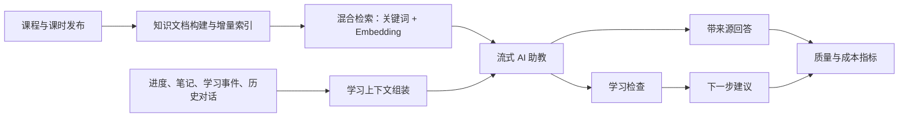

# AI Academy 路线图：当前进度 → v1.6.0

> 更新日期：2026-08-08
>
> 基线:`main` / `511ddb9`,应用包版本 `1.5.5`(v1.5.4 → v1.5.5 是 2–3 天的收口 release,详见 §2.2)
>
> 下一版本主题：**AI 学习闭环**——让 AI 从“能回答”升级为“理解当前学习上下文、实时反馈、给出下一步”。

---

## 1. 当前进度

### 1.1 结论

项目已完成可演示、可部署的教育平台主干，当前不缺页面和业务模块，主要缺口已经从“功能数量”转为：

1. AI 助教仍是关键词检索 + 一次性返回，产品差异化不足；
2. 自动化测试很完整，但浏览器 smoke 主要验证前端降级，真实前后端发布闭环仍需固化；
3. 文档、包版本、Git tag 和实际代码存在版本漂移；
4. 当前工作区还有一组讲师体系收尾改动，尚未形成 release。

### 1.2 已完成能力

| 维度 | 当前状态 | 判断 |
| --- | --- | --- |
| 学习业务 | 课程、学位、课时、资源、报名、进度、笔记、评价、实践、证书、积分、徽章 | 主闭环已完成 |
| 内容与运营 | 讲师、黑客松、企业咨询、通知、搜索、CMS 16 类配置、后台 CRUD | 主闭环已完成 |
| AI | 课程/学位草稿、用户级模型配置、全站助手、来源引用、失败兜底 | 可用，但体验和检索质量待升级 |
| 账号 | 邮箱密码、OAuth、SAML、刷新令牌轮换、登出撤销、密码重置 | 可上线基线 |
| 工程 | React 19 + NestJS + MySQL + Redis + MinIO、生产 Compose、健康检查、备份/回滚文档 | 可部署基线 |
| White-label | 品牌、导航、页面文案、枚举、列表配置后台化 | 已形成明确优势 |
| 测试 | API 38 suites / 358 tests；Web 23 files / 143 tests；浏览器 29 passed / 1 skipped | 单测与壳层 smoke 健康 |

### 1.3 2026-08-08 实测结果

- `pnpm check`：通过；lint 无 error，有 10 条 `console` warning；全部单元测试和生产构建通过。
- API：38/38 suites、358/358 tests 通过。
- Web：23/23 files、143/143 tests 通过。
- Playwright：29 passed、1 skipped；桌面与移动端基础交互通过。
- 生产构建：通过；最大业务 chunk 为 `AdminCoursesPage` 约 134 KB，React vendor 约 491 KB（压缩后约 150 KB）。

### 1.4 当前正在收尾的未提交工作

当前工作区有 6 个已修改文件，不能在发版时遗漏：

- demo seed 补齐 `admin@opencsg.com`；
- `SafeUrl` 支持自定义协议白名单；
- 课程/讲师后台删除与解绑统一 `ConfirmDialog`；
- 课程列表按真实讲师关联筛选，并修复“等 N 位”计数；
- 讲师统计加载失败增加明确提示。

这些改动应先作为 v1.5.5 收口，不与 v1.6.0 的 AI 主线混在同一个提交里。

### 1.5 已知缺口

| 优先级 | 缺口 | 影响 |
| --- | --- | --- |
| P0 | ~~版本治理漂移：根包仍为 `1.0.0`，子包为 `1.5.4`，Git tag 只到 `v1.4.1`~~ (v1.5.5 已统一到 `1.5.5` + tag `v1.5.5` 落地) | ~~无法准确判断已发布版本~~ |
| P0 | 浏览器 smoke 在 API 未启动时也可全过，不能证明注册→学习→完成→证书的真实链路 | 发布信心不足 |
| P1 | RAG 仍为 Prisma `contains`，仅检索课程/学位/黑客松/站点配置 | 不能理解课时内容，相关性有限 |
| P1 | AI 回答一次性返回，没有首 token、取消、断线恢复体验 | 用户感知慢 |
| P1 | 学习事件已经采集，但没有形成学习建议、薄弱点或运营分析 | 数据只存不用 |
| P1 | 通知列表 `total` 在非“仅未读”筛选下仍统计未读，字段语义错误 | 分页总数不准确 |
| P2 | 缺少 request-id、AI 调用耗时/错误率/模型用量指标 | 线上问题定位较弱 |
| P2 | 用户手册仍有“进度后续接”“看板为 mock”等过期描述 | 对外交付易产生误解 |

---

## 2. 下一版本：v1.6.0「AI 学习闭环」

### 2.1 版本目标

一句话目标：**学员在任意课时提问时，AI 能结合当前课时、学习进度、笔记与历史对话，流式给出带来源的回答，并能生成一次学习检查和明确的下一步。**

v1.6.0 不追求再增加一批孤立页面，重点打通下面的闭环：

### 2.2 P0：发布基线（v1.5.5，2–3 天）

在进入特性开发前完成：

1. 完成并测试当前 6 个未提交文件；
2. 修复通知 `total` 语义；
3. 同步根包、Web、API、shared-types 版本，补 `v1.5.5` changelog 和 tag；
4. 更新 README 与用户/管理员手册中的过期状态；
5. 新增“真实依赖 E2E”发布任务：启动 MySQL/Redis/MinIO/API/Web，验证注册、登录、选课、完成课时、证书、通知；
6. 清理 lint warning，要求 release 分支 `pnpm check` 零 error、零 warning。

验收：工作区干净、版本一致、真实业务流全过、可从空环境用 `scripts/setup-demo.sh` 一次启动。

### 2.3 P0：课时级混合 RAG

新增统一知识文档层，索引范围包括：

- Course / NanoDegree / Hackathon；
- Chapter / Lesson / Resource；
- 可公开的 SiteSetting / PageSetting。

实现原则：

1. 发布或更新内容时增量重建知识文档；
2. 提供可重复执行的 backfill/reindex 命令；
3. 先用关键词召回候选，再用 embedding 重排，避免每次把全库向量载入内存；
4. embedding 或上游模型不可用时自动退回现有关键词检索；
5. 每个回答保留可点击来源，禁止无来源的事实性课程推荐；
6. 建立至少 50 条中英文检索评测集，作为发布门禁。

建议数据模型：`KnowledgeDocument` 保存来源类型、来源 ID、版本、文本摘要、内容哈希和 embedding JSON；内容哈希不变时不重复调用模型。

验收：评测集 Recall@5 ≥ 85%，引用正确率 ≥ 90%，内容更新后 1 分钟内可检索，降级路径有自动化测试。

### 2.4 P0：上下文化、流式 AI 助教

助教上下文按最小必要原则组装：

- 当前课程、模块、课时和资源；
- 当前学员的课程进度与最近学习事件；
- 当前课时笔记（明确提示用户会被用于回答）；
- 当前会话最近 N 轮消息，不发送无关历史。

接口采用 `POST .../messages/stream` + `fetch` 流读取，返回 `text/event-stream` 或 NDJSON。不要直接依赖浏览器 `EventSource`，因为当前鉴权需要 Bearer token，且提问本身需要 POST body。

前端必须支持：

- 首 token 状态与逐字输出；
- 用户主动停止；
- 断线后明确提示并可重试；
- 流结束后一次性落库，避免半条 assistant message；
- provider 不支持流式时退回现有完整响应；
- Nginx 关闭该路径 buffering，并补部署验证。

验收：首 token p75 ≤ 2 秒（不含本地模型冷启动），中止请求不残留半条消息，四类 provider 至少完成契约测试，50 并发流无进程崩溃。

### 2.5 P1：学习检查与下一步建议

在每个课时增加两个主动触发入口：

1. **检查我是否学会**：基于课时目标生成 3–5 题，提交后逐题解释；
2. **下一步学什么**：结合进度、错题和最近学习事件，推荐一个具体课时或实践项目。

首版不引入复杂自适应学习算法，使用可解释规则 + AI 生成：

- 未完成当前课时 → 优先继续当前课时；
- 当前检查低于 60% → 推荐复习对应资源；
- 60%–80% → 推荐巩固题或实践；
- 80% 以上 → 推荐下一课时；
- 所有建议必须带“为什么推荐”和目标链接。

新增事件：`ai_question_asked`、`ai_answer_completed`、`knowledge_check_started/completed`、`next_step_clicked`，用于判断功能是否真正帮助学习。

验收：检查结果可重复查看；建议链接有效；不因模型失败阻塞正常课程学习；后台能看到使用次数、完成率和点击率。

### 2.6 P1：可观测性与成本护栏

1. 为每个请求生成/透传 `X-Request-Id`；
2. 记录 AI provider、model、耗时、输入/输出 token 估算、结果状态，不记录 API key 和完整私人笔记；
3. 暴露 HTTP 与 AI 基础指标：请求量、错误率、p50/p95、首 token、模型调用量；
4. 配置用户级/平台级每日额度和单次最大上下文；
5. 前端 ErrorBoundary 上报脱敏错误，并可按 request-id 关联后端日志。

验收：能回答“哪个模型失败最多、一次回答多慢、今天用了多少、某次报错经过什么链路”。

---

## 3. 里程碑与排期

以下为 1 名全栈开发的保守排期；前后端并行可压缩到约 4 周。

| 阶段 | 时间 | 交付物 | 退出条件 |
| --- | --- | --- | --- |
| v1.5.5 基线 | 第 1 周前半 | 当前改动收口、版本一致、真实 E2E | 可稳定 tag |
| v1.6.0-alpha.1 | 第 1–2 周 | 知识文档、backfill、混合检索、评测集 | RAG 指标达标 |
| v1.6.0-alpha.2 | 第 3 周 | 上下文组装、流式协议、助教 UI | 流式全链路稳定 |
| v1.6.0-beta.1 | 第 4 周 | 学习检查、下一步建议、事件指标 | 学习闭环可演示 |
| v1.6.0 | 第 5 周 | 可观测、压测、安全回归、文档与发布 | 全部门禁通过 |

---

## 4. 发布门禁

v1.6.0 必须同时满足：

- `pnpm check` 零错误，release 分支零 lint warning；
- API、Web 单测全过，新增 RAG/流式/学习检查测试；
- 浏览器 smoke 全过；
- 真实依赖 E2E 全过，不能仅靠前端 API 降级；
- RAG Recall@5 ≥ 85%，引用正确率 ≥ 90%；
- 50 并发流稳定，超时、中止、模型失败均有可解释状态；
- 无 P0/P1 安全问题；
- package version、CHANGELOG、README、镜像 tag、Git tag 一致；
- 从全新环境完成一次安装、迁移、seed、备份与回滚演练。

---

## 5. 明确不进入 v1.6.0

- PWA / 离线课程 / push notification；
- AI 自动生成可运行 sandbox 项目；
- AI 自动审核学员评价；
- 微服务、Kubernetes、GraphQL；
- 新增第三种界面语言；
- 原生 iOS/Android 客户端；
- 真实支付渠道。

真实支付需要单独的商业决策：若产品继续以企业咨询/交付为主，保持当前生产环境禁用 mock 支付；若转为自助售课，再单独开 v1.7.0，完整设计支付渠道、webhook、对账、退款和税务流程。

---

## 6. v1.6.0 成功指标

发布后 2–4 周观察：

| 指标 | 目标 |
| --- | --- |
| AI 助教回答成功率 | ≥ 98%（含自动降级） |
| 来源点击率 | ≥ 15% |
| 学习检查完成率 | ≥ 40% |
| 下一步建议点击率 | ≥ 25% |
| AI 功能引发的前端错误率 | < 0.5% |
| 完成学习检查用户的次周回访率 | 比未使用用户高 10%（观察指标，不作为首发硬门禁） |

如果使用数据不足，不用虚构结论；先确认埋点覆盖和样本量，再决定 v1.7.0 是深化个性化、接真实支付，还是做移动端。
